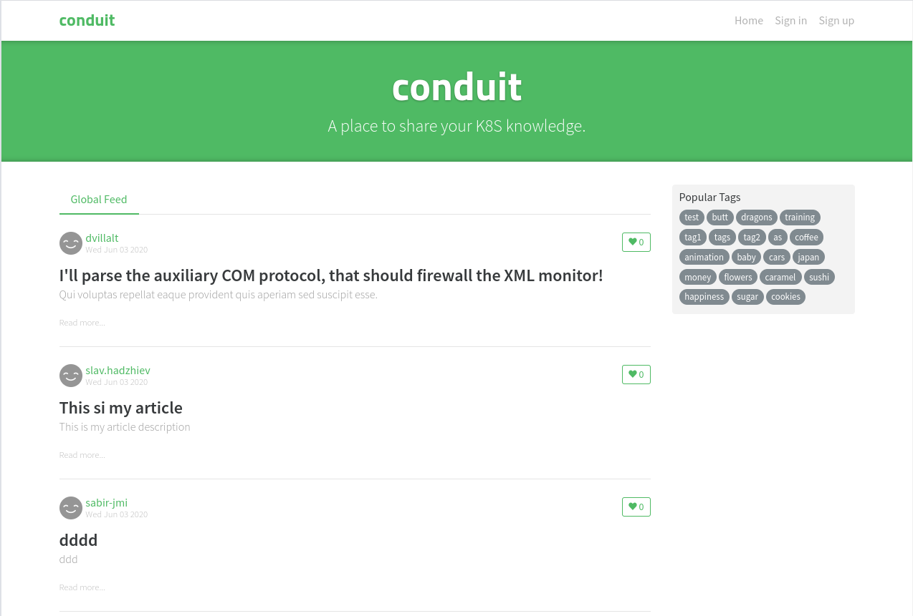

# Eclipse Che demo on Minikube

This demo is about [Eclipse Che](https://www.eclipse.org/che/) on [Kubernetes](https://kubernetes.io) and it is part of [Kubernetes-IT](https://t.me/kubernetes_it) Telegram Community weekly events of [June 3 2020](https://www.eventbrite.it/e/biglietti-kubernetes-it-sviluppare-su-kubernetes-con-eclipse-che-107109477330#)

Demo flow:

* We started from React Workspace
* Customized the workspace forking the [React Realworld example app](https://github.com/gothinkster/react-redux-realworld-example-app)
* * Created a Devfile in [forked repo](https://github.com/blues-man/react-redux-realworld-example-app)
* * Created a [Dockerfile](https://github.com/blues-man/react-redux-realworld-example-app/blob/master/Dockerfile) for building the "production" image
* * Created [K8S resources](https://github.com/blues-man/react-redux-realworld-example-app/tree/master/k8s) for "production" deployment
* Used Factory to start a new workspace from our changes
* Made changes to the code, tested locally with embedded browser into IDE
* Pushed changes on Quay.io Registry which triggered a new build of container image from Dockerfile
* Deployed k8s resources on Minikube
<br/>
<br/>


Slides are available [here](https://github.com/blues-man/eclipse-che-minikube-demo/blob/master/Eclipse_Che_Rocks.pdf)


# Demo steps

Download and start latest [Minikube](https://github.com/kubernetes/minikube/releases/tag/v1.11.0)

## Enable OLM addon

```
$ minikube addons enable olm
```
### Storageclass

Due a [bug](https://github.com/eclipse/che/issues/16545) with Minikube `storage-provisioner` addon, we can decide to workaround it using a custom storage class using hostpath, or rely on `storage-provisioner-gluster` addon

#### Storage-provisioner (default)

Apply workaround
```
$ kubectl create -f storageclass_and_volumes.yaml
```

#### Storage-provisioner-gluster

Enable addon:

```
$ minikube addons enable storage-provisioner-gluster
```

#### Provide NFS PVs

You can create some PV with different sizes from NFS share that can be used by Che

## Enable ingress and ingress-dns addon

```
$ minikube addons enable ingress
$ minikube addons enable ingress-dns
```
## Install Operator

Install Eclipse Che Operator from [OperatorHub.io](https://operatorhub.io/operator/eclipse-che)

```
$ kubectl create -f https://operatorhub.io/operator/eclipse-che
```

Verify is installed in my-eclipse-che namespace

```
$ kubectl get csv -n my-eclipse-che
NAME                  DISPLAY       VERSION   REPLACES   PHASE
eclipse-che.v7.13.2   Eclipse Che   7.13.2               Succeeded
```

## Install Eclipse Che CR

Modify CheCluster CR with your ingress domain (e.g. `minikube ip`.nip.io) and your favourite settings

```
apiVersion: org.eclipse.che/v1
kind: CheCluster
metadata:
  name: eclipse-che
spec:
  k8s:
    ingressDomain: '192.168.39.75.nip.io'
    tlsSecretName: ''
  server:
    cheImageTag: ''
    devfileRegistryImage: ''
    pluginRegistryImage: ''
    tlsSupport: false
    selfSignedCert: true
    customCheProperties:
      CHE_LIMITS_USER_WORKSPACES_RUN_COUNT: "5"
  database:
    externalDb: false
    chePostgresHostName: ''
    chePostgresPort: ''
    chePostgresUser: ''
    chePostgresPassword: ''
    chePostgresDb: ''
  auth:
    identityProviderImage: ''
    externalIdentityProvider: false
    identityProviderURL: ''
    identityProviderRealm: ''
    identityProviderClientId: ''
  storage:
    postgresPVCStorageClassName: eclipseche
    workspacePVCStorageClassName: eclipsechewksp
    pvcStrategy: common
    pvcClaimSize: 10Gi
    preCreateSubPaths: true

```
If you used default storage-provisioner addon:

```
$ kubectl create -f CheCluster-hostpath.yaml -n my-eclipse-che
```

If you used gluster-storage-provisioner or NFS PVs:

```
$ kubectl create -f CheCluster-gluster.yaml -n my-eclipse-che
```

## Verify ingresses

```
$ kubectl get ingresses -n my-eclipse-che
NAME               CLASS    HOSTS                                                  ADDRESS         PORTS   AGE
che                <none>   che-my-eclipse-che.192.168.39.75.nip.io                192.168.39.75   80      8h
devfile-registry   <none>   devfile-registry-my-eclipse-che.192.168.39.75.nip.io   192.168.39.75   80      7h57m
keycloak           <none>   keycloak-my-eclipse-che.192.168.39.75.nip.io           192.168.39.75   80      8h
plugin-registry    <none>   plugin-registry-my-eclipse-che.192.168.39.75.nip.io    192.168.39.75   80      7h57m
```

### Start coding!

Browse to `che` address like [che-my-eclipse-che.192.168.39.75.nip.io](che-my-eclipse-che.192.168.39.75.nip.io)

Register and login


### Demo

Demo has been done on Hetzner server exposing Minikube outside via [NGINX Proxy](#nginx-conf) with Websocket support.

Use this [Repo](https://github.com/blues-man/react-redux-realworld-example-app) for Factory demo

[](http://che-my-eclipse-che.148.251.9.136.nip.io/factory?url=https://github.com/blues-man/react-redux-realworld-example-app/)

#### Deploy app on Minikube

Once app has been modified and tested on Eclipse Che, you can deploy it in your favourite namespace:

```
$ git clone https://github.com/blues-man/react-redux-realworld-example-app
$ cd react-redux-realworld-example-app
```

The demo will create a container on [Quay.io](https://quay.io/repository/bluesman/react-realworld) for each new change on master branch. K8S resources are ready to be used, modify `Ingress` with your ingress domain.

```
$ kubectl create -f k8s/deployment.yaml
$ kubectl create -f k8s/service.yaml
$ kubectl create -f k8s/ingress.yaml
```

Checkout your tested and reviewed [Demo app](http://react-realword-my-eclipse-che.148.251.9.136.nip.io/)





#### NGINX Conf

```
    server {
        listen       80 default_server;
        listen       [::]:80 default_server;
        server_name  che-my-eclipse-che.<YOUR-EXTERNAL-IP>.nip.io;
        root         /usr/share/nginx/html;

        include /etc/nginx/default.d/*.conf;

        location / {
                proxy_redirect off;
                proxy_buffering off;
                proxy_set_header        Host            $host;
                proxy_set_header        X-Real-IP       $remote_addr;
                proxy_set_header        X-Forwarded-For $proxy_add_x_forwarded_for;
                proxy_pass              http://192.168.39.40/;
                proxy_http_version 1.1;
                proxy_set_header Upgrade $http_upgrade;
                proxy_set_header Connection "Upgrade";

        }

        error_page 404 /404.html;
            location = /40x.html {
        }

        error_page 500 502 503 504 /50x.html;
            location = /50x.html {
        }
    }
```
